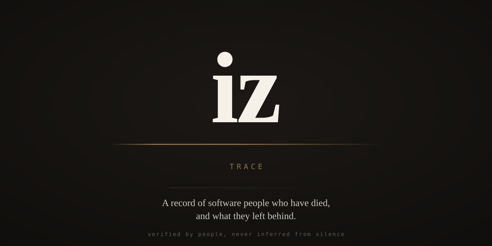

<p align="center">
  
</p>

# iz

*iz* is Turkish for **trace** — the mark something leaves behind.

Software people die, and most of the time the rest of us never hear about it.
The code keeps running. It compiles every day, ships in things we use, sits in
the dependency tree of half the internet. The person who wrote it is gone and
there is no announcement, no moment where anyone stops.

This is a record of some of those people and what they left behind.

## What this is not

It is not a database of inactive accounts. It is not automated. Nothing here is
inferred from someone going quiet.

**Silence is not death.** People leave a project because they changed jobs,
burned out, got sick, had a child, went private, or simply stopped caring about
the thing they used to care about. Treating an empty contribution graph as
evidence would eventually declare a living person dead — and that is a harm no
amount of accuracy elsewhere makes up for.

So there is no detection here. Only verification.

## How someone is added

Every entry needs **at least two independent primary sources** — a family
statement, an official death notice, an employer or project announcement, a
proper obituary — and a maintainer who has opened every link and confirmed it.

The full rules are in [POLICY.md](POLICY.md). Please read it before opening a
pull request; it is the part of this project that actually matters.

## Removal

**If you are a family member and want an entry removed, it is removed.**
Immediately, without argument, without asking why.

Open a [removal request](../../issues/new?template=removal-request.yml) or email
the address at the bottom of this file. The same applies to correcting a detail,
taking down a photograph, or reducing an entry to just a name and dates.

You do not need a reason. You do not need to justify anything.

## Who is here

Fourteen entries so far, each verified against two independent primary sources.

| | |
| --- | --- |
| [Fred Brooks](people/fred-brooks.yml) | 1931–2022 · System/360, *The Mythical Man-Month* |
| [Ward Christensen](people/ward-christensen.yml) | 1945–2024 · XMODEM, the first BBS |
| [Joe Armstrong](people/joe-armstrong.yml) | 1950–2019 · Erlang |
| [Bill Atkinson](people/bill-atkinson.yml) | 1951–2025 · QuickDraw, MacPaint, HyperCard |
| [Jennell Jaquays](people/jennell-jaquays.yml) | 1956–2024 · Caverns of Thracia, Quake II |
| [Bram Moolenaar](people/bram-moolenaar.yml) | 1961–2023 · Vim |
| [Rebecca Heineman](people/rebecca-heineman.yml) | 1963–2025 · Interplay, The Bard's Tale III |
| [Dave Täht](people/dave-taht.yml) | 1965–2025 · FQ-CoDel, CAKE, the bufferbloat work |
| [Aaron Swartz](people/aaron-swartz.yml) | 1986–2013 · RSS, Creative Commons, Open Library |
| [Ian Murdock](people/ian-murdock.yml) | died 2015 · Debian |
| [Near](people/near.yml) | died 2021 · bsnes, higan |
| [Kent Fredric](people/kent-fredric.yml) | died 2021 · CPAN, Gentoo's Perl support |
| [Wolfgang Denk](people/wolfgang-denk.yml) | died 2022 · U-Boot |
| [Robert Kaye](people/robert-kaye.yml) | died 2026 · MusicBrainz, MetaBrainz |

Some entries carry no birth date, or only a year of death. Where the sources
do not say, nothing is written down — a date inferred from an age, or guessed
at from the week an announcement was posted, would be an invented record.

## Structure

```
people/          one YAML file per person, plus the schema
scripts/         validation (TypeScript, run with bun)
docs/            research notes, including how candidates are gathered
```

Each entry is a plain text file in git. Contributions are pull requests, review
is code review, and every change has an author and a history. That is the whole
mechanism — it needs no infrastructure and it can be audited by anyone.

## Contributing

```bash
bun run validate
```

Copy `people/_example.yml`, fill it in, and open a pull request. CI checks the
structure. A human checks the truth.

See [CONTRIBUTING.md](CONTRIBUTING.md).

## A note on tone

These are entries about people, written for the people who loved them as much
as for strangers. They say what someone built and what it meant. They do not
speculate about how someone died, and they do not treat a life as a changelog.

If you are here because someone you know is in this list: we are sorry. If
anything about their entry is wrong, tell us and we will fix it.

## Contact

Open an issue, or reach the maintainers at the address listed in the repository
profile.

## Licence

Entry text is CC BY-SA 4.0. Code is MIT. Photographs remain under whatever
licence or permission is recorded in each entry — see [POLICY.md](POLICY.md).
